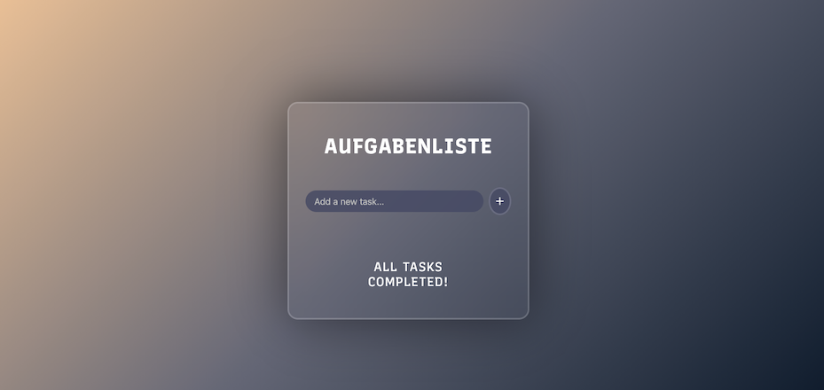

# Browser To-Do List
This is a simple browser based To-Do List application that can save users inputted tasks locally as well as edit and delete them. 



**Link to Project:** https://covertcapper.github.io/browser-to-do-list/

I created this project using very little AI. I only used it to assist me if I absolutely could not solve a problem and never had it make the code for me. 

## How It's Made
**Tech used:** HTML, CSS, JavaScript.

Before beginning this project, I began by learning Git. People in the programming industry told me that lots of beginners ignore doing this and that it was a good idea that I just started with it. After finishing that, I began a simple HTML review since I already had an understanding of how to use the language. I then spent just over a month doing a CSS course, and after that moved on to JS. While doing the JS course, I decided I wanted to start this project to try and change up my learning each day so I wouldn't get bored. I watched some different tutorials on building a simple to-do list app so I wasn't just copying code and tried to make it my own a bit. I found this difficult once it came to the JS because I didn't have a full understanding of how that worked. I did my best to break it down though and at least see how different elements were connecting to my HTML and what they were doing. I was able to edit the CSS to my liking more since I had an understanding of that. Still though, working on this project has shown me I still have a lot to learn. 

## Lessons Learned
- How to better use Flexbox when placing elements that need to resize in a container. 
- Slightly more of an understanding for practical JS uses as opposed to only doing simple exercises using variable, loops, etc. 
- The transition property in my css was affecting text when I optimized the app for smaller screens. The text was meant to shrink, and it would shrink slowly as if animated. A small nuance, but I figured out how to fix it anyways. 
- Learned how to create buttons with smooth animations when you hover and click. 
- Improved workflow when using git (cleaner commit messages, keeping "main" clean) and understanding how to commit with the terminal.
- Learned about using .gitignore.
- Had an issue where the text in the to-do list items was not wrapping and would spill outside of the container. I learned how to correct this with:
```
overflow-wrap: break-word; 
``` 
- I also learned how to use "flex:1" so that the text would'd push the edit and delete buttons out of the container. 